# FLIXORA

FLIXORA is a Flutter application for exploring movies and TV shows via [TMDB](https://www.themoviedb.org/). Users can browse the catalog, filter by genre, search for titles, view details, and save favorites to **My List**. This app provides viewing information and does not play videos.

## App Demo

[](https://www.youtube.com/shorts/WnZEUUhngl8)

This screen recording demonstrates the flow from the splash screen and shimmer loading, Home, empty My List, catalog and **See All**, movie genre filters, viewing details and saving titles, TV show genre filters with season lists, search functionality, empty search results, and network interruption/recovery.

## Feature Screenshots

All screenshots were taken from the app running on an Android emulator. Posters, titles, ratings, and catalog order are sourced from TMDB and may change. The offline state was captured using airplane mode; the missing token state was captured using a temporary build without a token.

### Splash and Home

| Animated Splash | Loading Shimmer | Home and Hero Carousel |
|:---:|:---:|:---:|
|  | 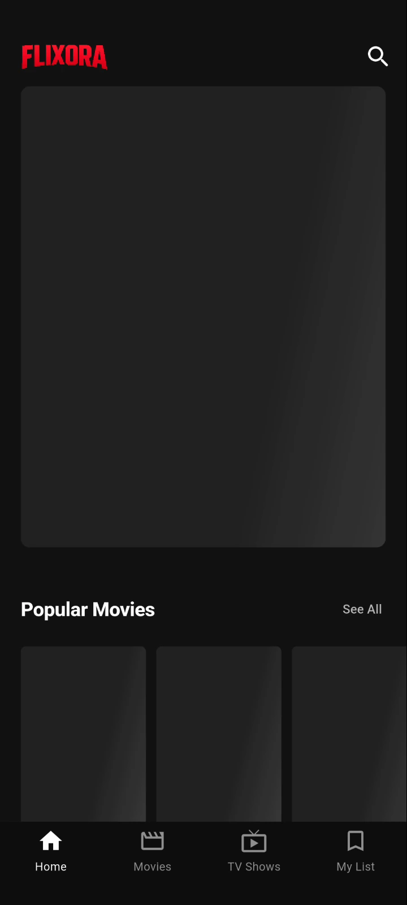 | 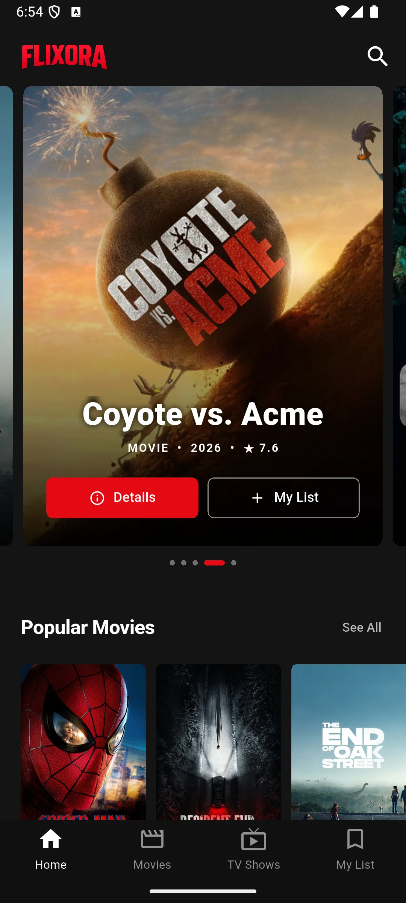 |

### Explore Movies

| Movies | All titles in a category | Genre Selection |
|:---:|:---:|:---:|
| 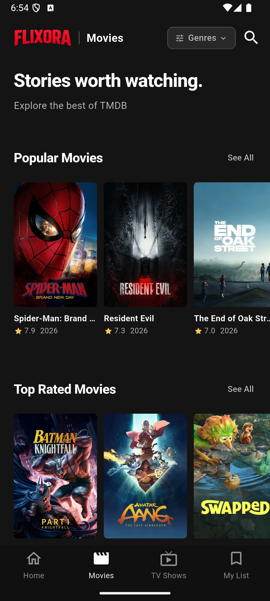 | 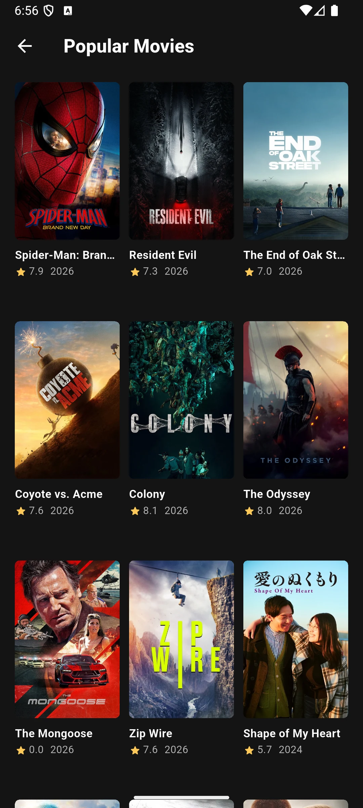 | 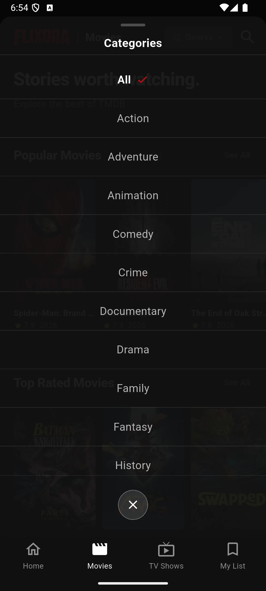 |

| Action Filter Results | Movie Details | Saved Movie |
|:---:|:---:|:---:|
| 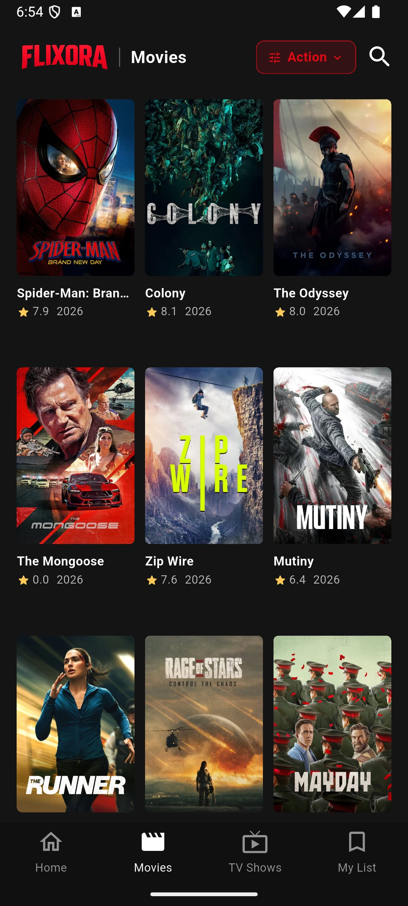 | 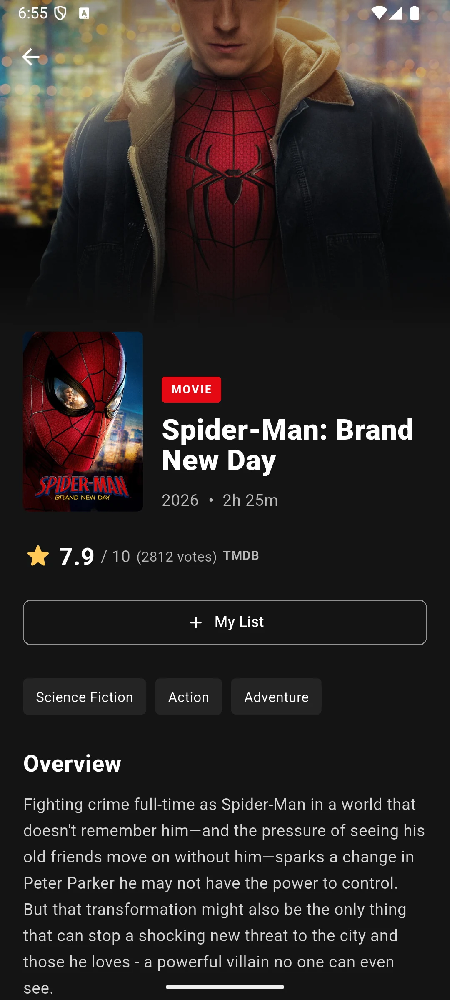 |  |

### Explore TV Shows

| TV Shows | TV Genre Selection | Action & Adventure Filter Results |
|:---:|:---:|:---:|
| 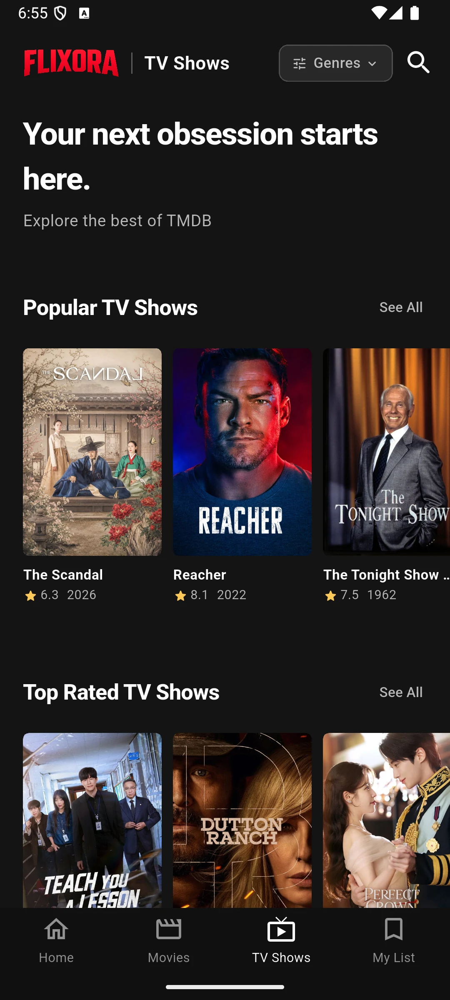 | 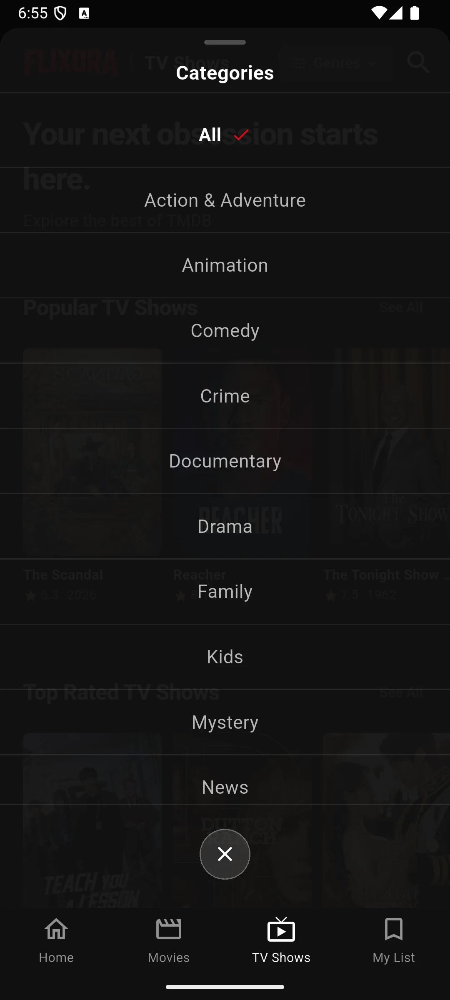 | 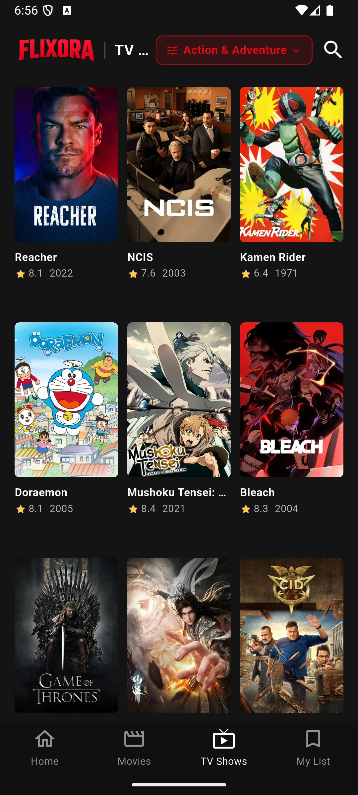 |

| TV Show Details | Seasons and Episodes |
|:---:|:---:|
|  | 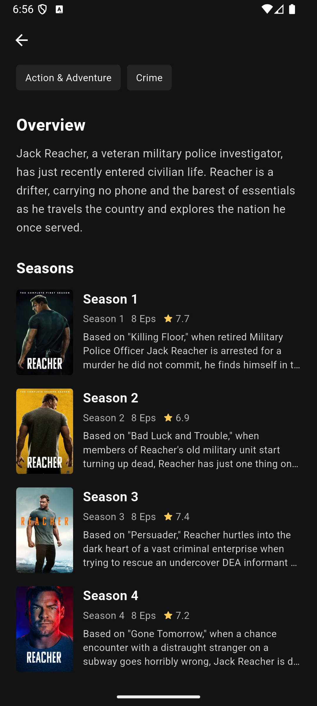 |

### Search and My List

| Initial Search State | Minimum Two Characters | Search Results |
|:---:|:---:|:---:|
| 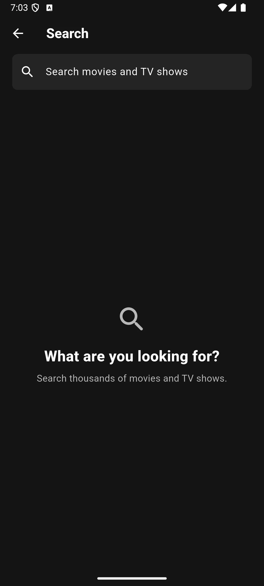 | 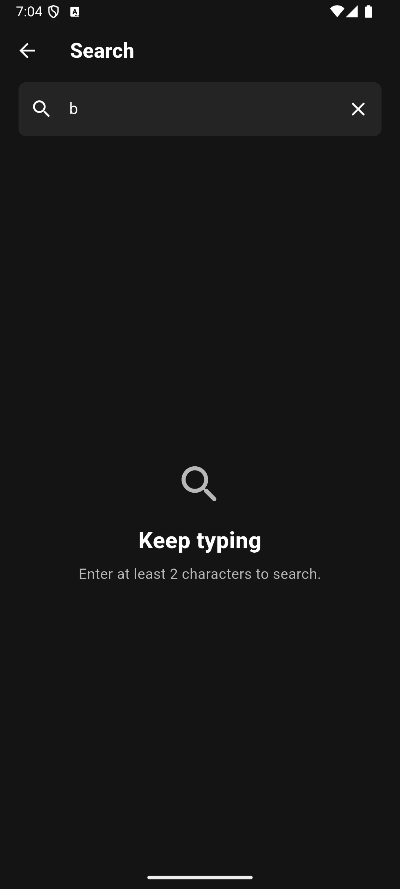 | 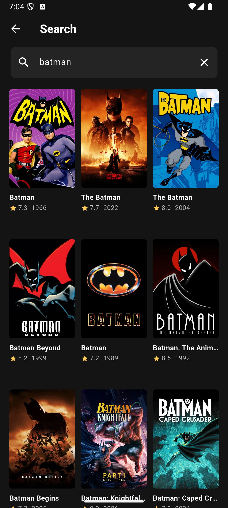 |

| No Results | Empty My List | Populated My List |
|:---:|:---:|:---:|
| 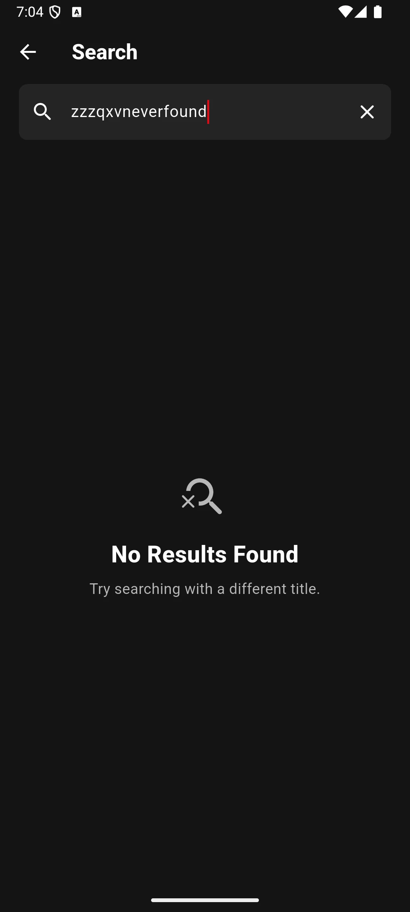 | 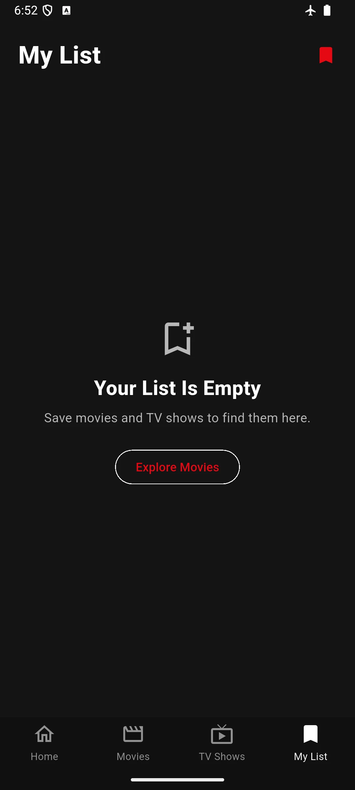 | 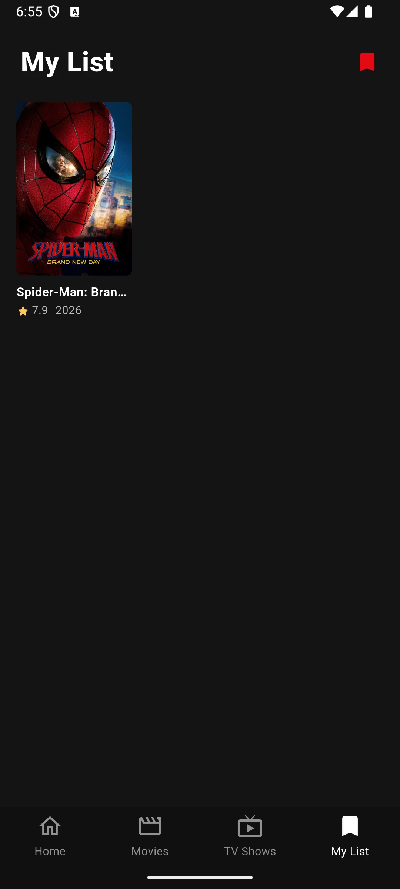 |

### Loading and Error Handling

| Offline Catalog | Offline Search | Missing TMDB Token |
|:---:|:---:|:---:|
| 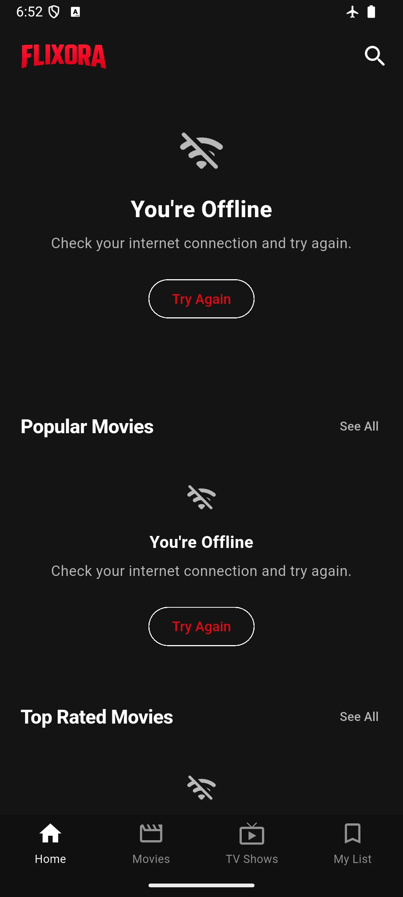 | 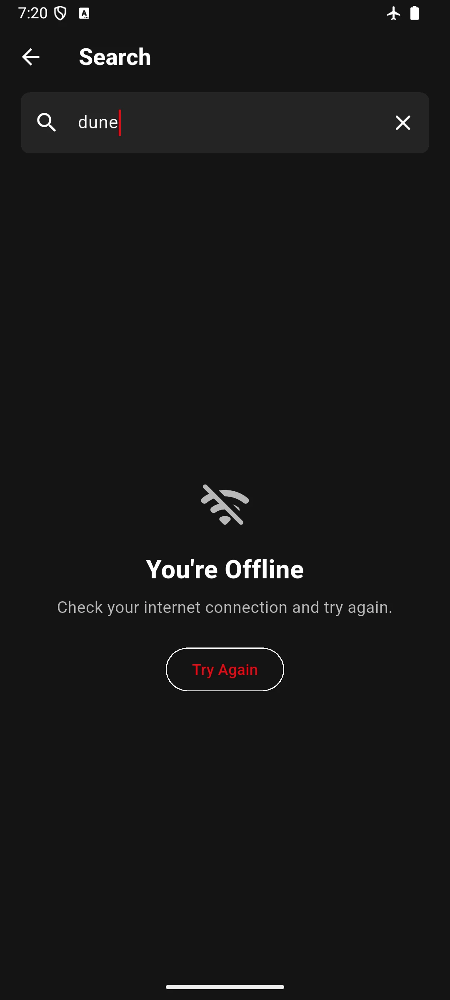 | 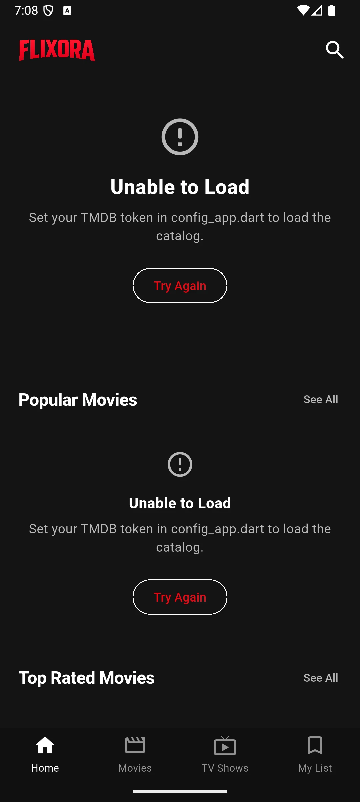 |

## Features

- **Splash:** Logo animation before entering Home.
- **Home:** Hero carousel, actions to view details or save titles, and catalog rails for movies and series.
- **Movies and TV Shows:** Popular and highest-rated catalogs; movie categories also include Now Playing and Coming Soon. The **See All** button opens a grid with infinite scrolling pagination.
- **Genre Filter:** Select **Genres** in Movies or TV Shows to display a filtered grid. Select **All** to return to the standard catalog. Filter results support pull-to-refresh and pagination.
- **Details:** Posters and backdrops, release year, runtime (movies) or season/episode count (TV), TMDB rating, genres, synopsis, and detailed season lists for TV shows.
- **Search:** Search for movies and TV shows starting from two characters, with input debouncing, progressive results, and empty states.
- **My List:** Save and remove titles; the list is stored locally on the device using `shared_preferences` and can be accessed offline.
- **App States:** Shimmer loading effects, empty states, offline messages, service/token errors, and **Try Again** actions.
- **Adaptive Layout:** Utilizes `flutter_screenutil` and dynamic poster columns based on screen width.

## Requirements

- [Flutter SDK](https://docs.flutter.dev/get-started/install) with Dart **>=3.10.4 and <4.0.0**. This project runs on Flutter **3.38.5**.
- [Android SDK](https://developer.android.com/studio) and an emulator or Android device for Android builds.
- macOS, Xcode, and CocoaPods for iOS builds.
- Internet connection and a **TMDB API Read Access Token** from [TMDB API Settings](https://www.themoviedb.org/settings/api) for catalog data.

Check your development environment:

```bash
flutter doctor
flutter devices
```

## Installation and Configuration

```bash
git clone https://github.com/galihtra/flixora.git
cd flixora
flutter pub get
cp lib/app/config_app.example.dart lib/app/config_app.dart
```

Fill in `AppConfig.tmdbToken` in `lib/app/config_app.dart` with your **API Read Access Token**:

```dart
abstract final class AppConfig {
  static const tmdbToken = 'YOUR_TMDB_API_READ_ACCESS_TOKEN';
}
```

The `lib/app/config_app.dart` file is ignored by Git. The repository only stores an empty `lib/app/config_app.example.dart`. The token is compiled into the app, so do not commit your personal token. If the token is missing or invalid, the catalog will fail to load, but the local My List will remain accessible.

## Running the App

Ensure your device ID is listed in `flutter devices`, then run:

```bash
flutter run -d DEVICE_ID
```

Example for an Android emulator:

```bash
flutter run -d emulator-5554
```

For iOS, open the iOS Simulator or connect a provisioned iPhone, then use the device ID from `flutter devices`. Physical iPhones require configuring **Signing & Capabilities** in `ios/Runner.xcworkspace` with your Apple Development Team.

## Building and Installing on a Device

To build a release APK for Android or IPA for iOS:

```bash
flutter build apk --release
flutter build ipa --release
```

### Manual Installation on Android

After building the APK, you can manually install it on an Android device:

1. Locate the generated APK at: `build/app/outputs/flutter-apk/app-release.apk`
2. Connect your Android device via USB and ensure **USB Debugging** is enabled in Developer Options.
3. Install the APK using adb:
   ```bash
   adb install build/app/outputs/flutter-apk/app-release.apk
   ```
4. Alternatively, transfer the `app-release.apk` file to your phone (via USB, email, or cloud storage) and tap on it from a file manager to install. Make sure "Install from unknown sources" is allowed on your device.

*Note: The iOS IPA build requires macOS, Xcode, and proper signing. The current Android configuration uses a debug signing key for local builds; prepare your own release keystore before public distribution.*

## Testing Special States

- **Shimmer:** Open the app immediately after installation or refresh the catalog while TMDB requests are pending.
- **Offline:** Disable internet on the emulator/device, open the catalog or search, then tap **Try Again** once the connection is restored.
- **Missing Token:** Leave `AppConfig.tmdbToken` empty in your local build to see the configuration error message on the catalog.
- **Empty Search:** Enter a query that does not match any known titles.
- **Empty My List:** Open My List before saving any titles. Once a title is saved, the list remains available locally.

## Project Structure

```text
lib/
├── main.dart            # Entry point
├── app/                 # Bootstrap, routing, configuration, and navigation
├── resources/           # Colors, strings, themes, assets, and dimensions
├── data/                # Models, providers, repositories, and API clients
├── pages/               # Main screens and screen-specific widgets
├── components/          # Reusable UI components
└── base_widgets/        # Shared base widgets

docs/
├── screenshots/         # Original screenshots from the emulator
└── demo/                # App screen recordings
```

## Running Tests

```bash
flutter analyze
flutter test
```

Tests in the `test/` directory cover API error handling, search logic, My List storage, and layout responsiveness across various screen sizes and text scales.

FLIXORA uses the TMDB API but is not endorsed or certified by TMDB.
