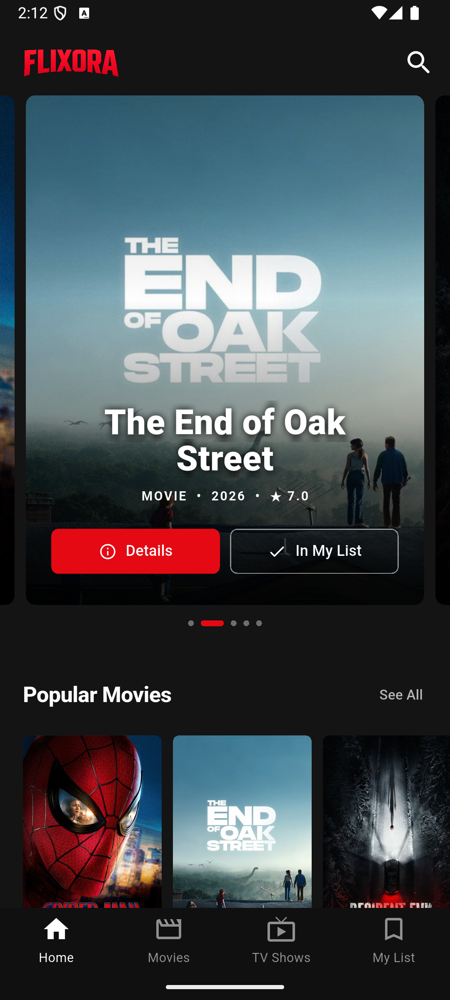
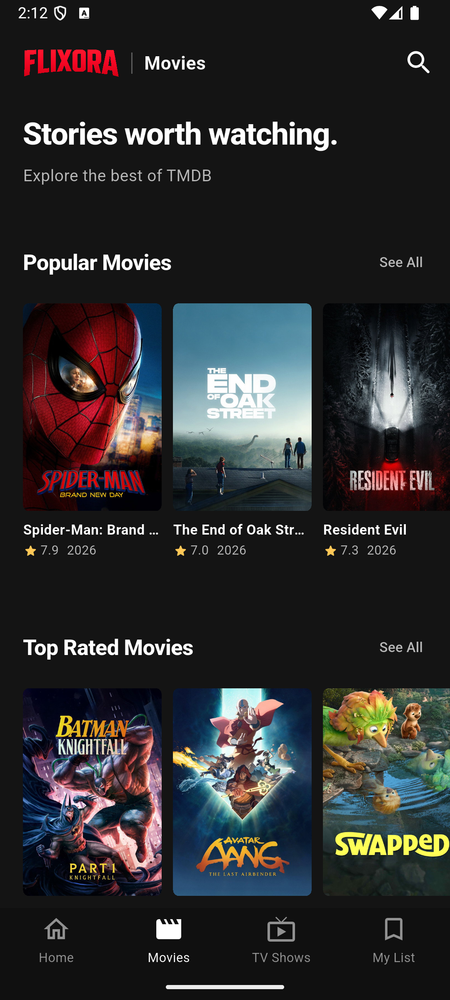
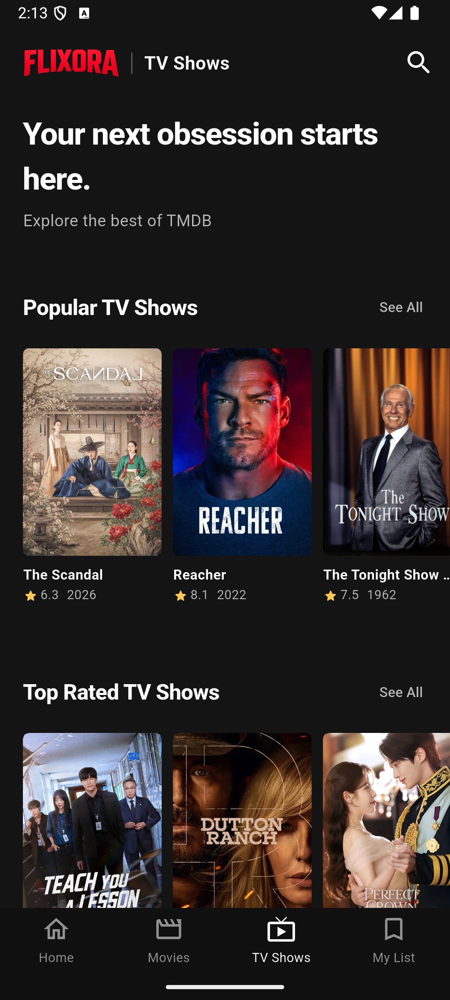
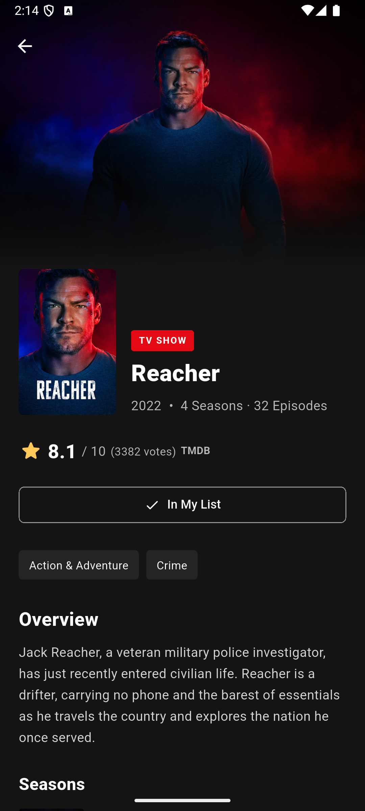
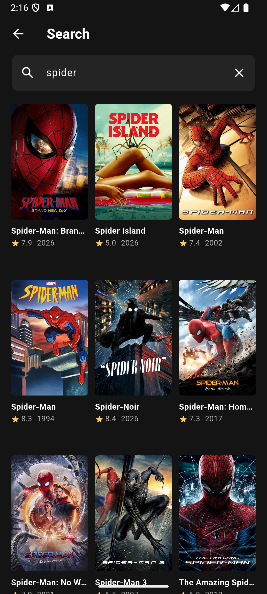
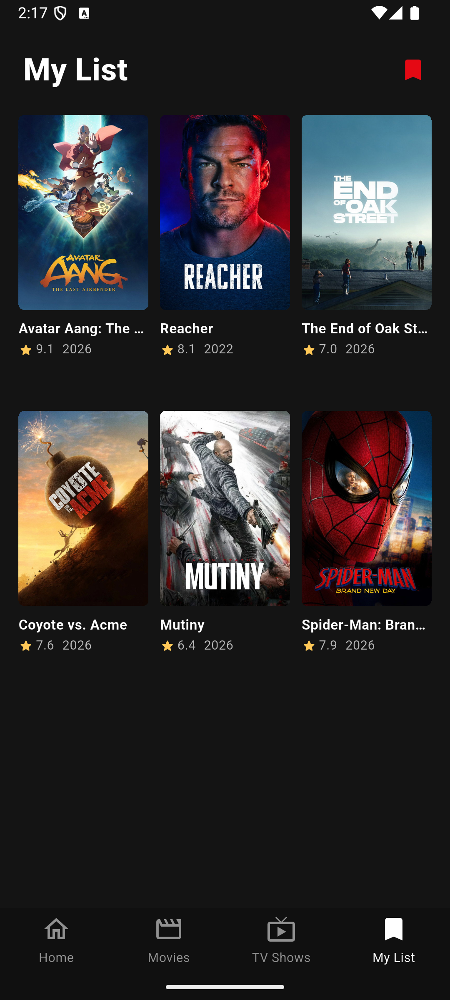

# FLIXORA

FLIXORA adalah aplikasi Flutter untuk menemukan film dan serial TV melalui [TMDB](https://www.themoviedb.org/). Tersedia katalog, pencarian, detail judul, dan **My List** yang tersimpan di perangkat. Aplikasi ini menampilkan informasi judul; tidak menyediakan pemutaran video.

## Tampilan aplikasi

Screenshot berikut diambil langsung dari FLIXORA yang berjalan di emulator Android. Isi katalog dan poster mengikuti data TMDB, sehingga dapat berubah.

| Home | Movies | TV Shows |
|:---:|:---:|:---:|
|  |  |  |

| Detail | Search | My List |
|:---:|:---:|:---:|
|  |  |  |

## Fitur

- **Home:** hero yang dapat digeser dan kategori film serta serial dari TMDB.
- **Movies & TV Shows:** katalog populer, rating tertinggi, dan halaman **See All** dengan pemuatan bertahap.
- **Detail:** poster, backdrop, rating, genre, sinopsis, durasi film atau informasi musim dan episode serial.
- **Search:** pencarian film dan serial dengan jeda input dan hasil yang dimuat bertahap.
- **My List:** simpan judul secara lokal menggunakan `shared_preferences`; daftar tetap tersedia tanpa koneksi internet.
- **Tampilan adaptif:** `flutter_screenutil`, grid poster yang menyesuaikan lebar layar, loading skeleton, pull-to-refresh, dan pesan kesalahan jaringan.

## Persyaratan

- [Flutter SDK](https://docs.flutter.dev/get-started/install) dengan Dart **>=3.10.4 dan <4.0.0**. Proyek ini dijalankan dengan Flutter **3.38.5**.
- [Android SDK](https://developer.android.com/studio) serta emulator atau perangkat Android untuk menjalankan versi Android.
- **macOS, Xcode, dan CocoaPods** untuk menjalankan versi iOS di simulator atau perangkat iPhone.
- Koneksi internet dan **TMDB API Read Access Token** dari [pengaturan API TMDB](https://www.themoviedb.org/settings/api) untuk memuat katalog.

Periksa lingkungan pengembangan dengan:

```bash
flutter doctor
flutter devices
```

## Instalasi

```bash
git clone https://github.com/galihtra/flixora.git
cd flixora
flutter pub get
```

Buat file konfigurasi lokal dari contoh yang tersedia:

```bash
cp lib/app/config_app.example.dart lib/app/config_app.dart
```

Isi `AppConfig.tmdbToken` di [`lib/app/config_app.dart`](lib/app/config_app.dart) dengan **API Read Access Token** milik Anda. Contoh bentuknya tanpa menampilkan token asli:

```dart
abstract final class AppConfig {
  static const tmdbToken = 'TMDB_API_READ_ACCESS_TOKEN_ANDA';
}
```

File `lib/app/config_app.dart` diabaikan Git; hanya `lib/app/config_app.example.dart` tanpa token yang disimpan di repositori. Konfigurasi menggunakan Dart, bukan JSON. Token dikompilasi ke dalam aplikasi; jangan menambahkannya ke commit pada repositori publik. Jika token kosong atau tidak valid, katalog tidak dapat dimuat, tetapi My List masih dapat dibuka.

## Menjalankan aplikasi

Pastikan emulator atau perangkat sudah terdeteksi pada `flutter devices`, lalu jalankan:

```bash
flutter run -d DEVICE_ID
```

Contoh untuk emulator Android dengan ID `emulator-5554`:

```bash
flutter run -d emulator-5554
```

Untuk iOS, buka iOS Simulator melalui Xcode atau hubungkan iPhone yang sudah disiapkan untuk pengembangan, kemudian jalankan `flutter devices` dan gunakan ID perangkat iOS pada perintah `flutter run -d DEVICE_ID`. Build di iPhone fisik memerlukan pengaturan **Signing & Capabilities** pada `ios/Runner.xcworkspace` dengan Apple Development Team Anda.

## Membuat build

```bash
# APK Android
flutter build apk --release

# iOS archive dan IPA; hanya di macOS dengan Xcode dan signing yang sesuai
flutter build ipa --release
```

APK tersedia di `build/app/outputs/flutter-apk/app-release.apk`, sedangkan IPA ada di `build/ios/ipa/`. Konfigurasi Android saat ini memakai **debug signing** untuk build lokal; atur keystore rilis milik Anda sebelum mendistribusikan APK.

## Struktur proyek

```text
lib/
├── main.dart            # entry point
├── app/                 # bootstrap, router, konfigurasi, dan navigasi
├── resources/           # warna, string, tema, dan nilai tampilan
├── data/                # model, provider, repository, dan API client
├── pages/               # layar utama dan widget khusus layar
├── components/          # komponen yang dipakai berulang
└── base_widgets/        # widget dasar bersama
```

## Pemeriksaan

```bash
flutter analyze
flutter test
```

Pengujian mencakup penanganan kesalahan API, pencarian, penyimpanan My List, dan layout pada beberapa ukuran layar serta skala teks.

FLIXORA menggunakan TMDB API, tetapi tidak didukung atau disertifikasi oleh TMDB.
